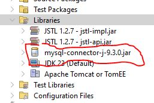

# CRUD di JSP

Pada umumnya, ketika kita membuat program yang mengakses database, pada umumnya hanya mencakup proses menambahkan data (create), edit data (update) dan menghapus (delete). Proses ini disebut sebagai CRUD.

Dalam pembelajaran kita, kita akan coba membuat halaman JSP yang mengakses database MySQL.

## Setup
Selain tentu selain menyiapkan database MySQL-nya itu sendiri, hal yang perlu kita siapkan untuk JSP kita bisa mengakses database MySQL adalah MySQL Connector/J. Ikut langkah berikut:
1. Download & extract [MySQL Connector/J](https://dev.mysql.com/downloads/connector/j/).
   1. Untuk _Operating System_, pilih _Plaform Independent_.
   2. Klik Download
2. Extract file `mysql-connector-j-x.x.x.jar` yang ada di dalamnya
3. Pada project kita di Netbeans
   1. Klik-kanan _Libraries_
   2. Add _JAR/Folder_
   3. Pilih file _jar_ yang sebelumnya kita _extract_\
      
4. Untuk latihan ini kita akan menggunakan database MySQL. Persiapkan database  `test` kemudian eksekusi script [test.sql](../src/test.sql)

## Cara sederhana membaca tabel

Kita akan coba membuat koneksi sederhana dengan membaca dan menampilkan data dari database ke halaman JSP kita.

```jsp
<%@ page import="java.sql.*" %>
<%
    // connection string, tidak perlu dirubah
    String DBDRIVER = "com.mysql.cj.jdbc.Driver";

    // URI database
    String DBCONNECTION = "jdbc:mysql://localhost:3306/test";

    // username & password database
    String DBUSER = "root";
    String DBPASS = "";

    Connection conn = null;
    Statement st = null;
    ResultSet rs = null;

    try {
        // menyiapkan koneksi
        Class.forName(DBDRIVER);
        conn = DriverManager.getConnection(DBCONNECTION, DBUSER, DBPASS);
        st = conn.createStatement();

        // eksekusi query
        rs = st.executeQuery("SELECT * FROM daftar");
    } catch (Exception e) {
        out.println("Error")
    }
%>
<%@page contentType="text/html" pageEncoding="UTF-8"%>
<!DOCTYPE html>
<html>
    <head>
        <meta http-equiv="Content-Type" content="text/html; charset=UTF-8">
        <title>JSP Page</title>
    </head>
    <body>
        <!-- loop membaca data -->
        <% while (rs.next()) {%>
            <%= rs.getInt("id")%><br>
            <%= rs.getString("nama")%><br>
            <%= rs.getInt("nilai")%><br>
            <hr>
        <% } %>
    
        <%  // tutup koneksi database
            rs.close();
            st.close();
            conn.close();
        %>
    </body>
</html>
```

**Perhatikan:**
- `<%@ page import="java.sql.*" %>` pada bagian awal diperukan untuk import fungsi `sql` untuk mengakses database
- `executeQuery` adalah perintah untuk mengeksekusi perintah SQL `SELECT`
- `ResultSet rs` objek yang menampung hasil eksekusi query
- `rs.next()` perintah membaca satu baris data. Fungsi ini akan mengembalikan nilai `false` jika semua data sudah dibaca.
- `rs.getInt()` dan `rs.getString()` sesuai dengan jenis datanya, adalah fungsi untuk membaca kolom pada baris aktif yang terakhir dibaca. 

## Contoh eksekusi INSERT

```jsp
<%@page contentType="text/html" pageEncoding="UTF-8"%>
<%@page import="java.sql.*" %>
<%
    // connection string, tidak perlu dirubah
    String DBDRIVER = "com.mysql.cj.jdbc.Driver";

    // URI database
    String DBCONNECTION = "jdbc:mysql://localhost:3306/test";

    // username & password database
    String DBUSER = "root";
    String DBPASS = "";
    Connection conn = null;
    Statement st;
    
    String nama = "Budi";
    String nim = "3923123";
    Integer nilai = 34;
    
    try {
        Class.forName(DBDRIVER);
        conn = DriverManager.getConnection(DBCONNECTION, DBUSER, DBPASS);

        // prepare select statement
        String sql = "INSERT INTO mahasiswa (nim,nama,nilai) values ('"+nim+"','"+nama+"',"+nilai+")";
        st = conn.createStatement();
        st.executeUpdate(sql);
        conn.close();
    } catch (Exception ex) {
        out.println("Error");
    }
%>
<!DOCTYPE html>
<html>
    <head>
        <meta http-equiv="Content-Type" content="text/html; charset=UTF-8">
        <title>Data Baru</title>

    </head>
    <body>
        NIM: <%= nim %><br>
        Nama: <%= nama %><br>
        Nilai: <%= nilai %><br>
    </body>
</html>
```

**Perhatikan:**
- Objek `nama`, `nim`, `nilai` dideklarasikan diluar blok `try` supaya objek ini bisa diakses di luar blok `try`
- Eksekusi `INSERT`, `UPDATE` dan `DELETE` menggunakan perintah `executeUpdate`

## Contoh eksekusi INSERT & _Parameter Query_

_Parameter Query_ adalah cara lain kita menyiapkan nilai-nilai yang kita akan olah ke dalam perintah SQL. Perhatikan contoh program berikut:

```jsp
<%@page contentType="text/html" pageEncoding="UTF-8"%>
<%@page import="java.sql.*" %>
<%
    // connection string, tidak perlu dirubah
    String DBDRIVER = "com.mysql.cj.jdbc.Driver";

    // URI database
    String DBCONNECTION = "jdbc:mysql://localhost:3306/test";

    // username & password database
    String DBUSER = "root";
    String DBPASS = "";
    Connection conn = null;
    PreparedStatement st;

    
    String nama = "Ratna";
    String nim = "832737";
    Integer nilai = 34;
    
    try {
        Class.forName(DBDRIVER);
        conn = DriverManager.getConnection(DBCONNECTION, DBUSER, DBPASS);

        // prepare select statement
        String sql = "INSERT INTO mahasiswa (nim,nama,nilai) values (?,?,?)";
        st = conn.prepareStatement(sql);
        st.setString(1, nim);
        st.setString(2, nama);
        st.setInt(3, nilai);
        st.executeUpdate();
        conn.close();
    } catch (Exception ex) {
        out.println("Error");
    }
%>
<!DOCTYPE html>
<html>
    <head>
        <meta http-equiv="Content-Type" content="text/html; charset=UTF-8">
        <title>Data Baru</title>

    </head>
    <body>
        NIM: <%= nim %><br>
        Nama: <%= nama %><br>
        Nilai: <%= nilai %><br>
    </body>
</html>
```

**Perhatikan:**
- `PreparedStatement st` berbeda dengan sebelumnya `Statement st`. `PreparedStatement` memungkinkan kita memanggil query menggunakan _parameter_. Perhatikan pada, kita menyisipkan tanda `?`. 
- Tanda `?` ini kita bisa beri nilai menggunakan perintah `st.setString()`. Sesuai dengan urutannya, `st.setString(1,nim)` berarti mengisi `?` pertama pada query dengan `nim`, dan seterusnya.

## Akses ke Database Lewat Database

Pada model MVC, tentu kita mau misahkan proses akses ke database dari controller dan view. Berikut akses database lewat class.

> ⚠ Pada contoh berikut, kita akan membuat folder khusus yang diberi nama `crud` untuk menyimpan class kita. Ingat, class disimpan di folder berbeda dengan halaman JSP kita.

file: `Source Package/crud/Mahasiswa.java`
```java
package crud;

import java.sql.*;

public class Mahasiswa {

    public String nim;
    public String nama;
    public Integer nilai;

    public boolean tambah()  {
        String DBDRIVER = "com.mysql.cj.jdbc.Driver";
        String DBCONNECTION = "jdbc:mysql://localhost:3306/test";
        String DBUSER = "root";
        String DBPASS = "";
        
        Connection conn = null;
        PreparedStatement st;

        try {
            Class.forName(DBDRIVER);
            conn = DriverManager.getConnection(DBCONNECTION, DBUSER, DBPASS);

            // prepare select statement
            String sql = "INSERT INTO mahasiswa (nim,nama,nilai) values (?,?,?)";
            st = conn.prepareStatement(sql);
            st.setString(1, this.nim);
            st.setString(2, this.nama);
            st.setInt(3, this.nilai);
            st.executeUpdate();
            conn.close();
            return true;
        } catch (Exception ex) {
            return false;
        }

    }
}
```

File: `mahasiswa.tambah.jsp`
```jsp
<%@page import="crud.Mahasiswa"%>
<%
    Mahasiswa mahasiswa = new Mahasiswa();
    mahasiswa.nim = "984294";
    mahasiswa.nama = "Yuda";
    mahasiswa.nilai = 45;
    
    if(mahasiswa.tambah()) {
        out.println("Data berhasil ditambahkan");
    } else {
        out.println("Data gagal disimpan");
    }
    
%>
```

**Perhatikan:**
- Coba ekskusi `mahasiswa.tambah.jsp`, maka record baru akan ditambahkan ke tabel `mahasiswa`.
- Method `tambah()` dibuat sebagai fungsi `boolean` supaya bisa bisa memberikan nilai `true` jika proses `INSERT` berhasil, `false` jika gagal.

