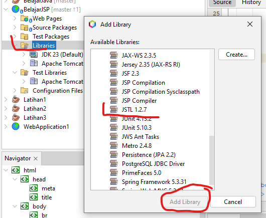

# JSTL + EL

JSTL (_Java Standard Tag Language_) dan EL (_Expression Language_) di Java EE ini merupakan fitur khusus yang digunakan untuk membantu pembangunan web, terutama terkait penerapan model pengembangan MVC (_Model-View-Controller_).

## Setup
Untuk bisa menggunakan JSTL, Anda perlu menambahkan library JSTL ini ke dalam project. Caranya:
1. Klik kanan pada project - **Libraries**
2. Pilih **Add Libraries**
3. Pilih **JSTL x.x.x**
4. Klik **Add Library**\
   

## Contoh JSTL + EL
Berikut ini contoh penggunaan JSTL juga implementasi class yang akses oleh halaman JSP lewat JSTL.

file: **Siswa.class**
```java
package belajarjsp;

public class Siswa {
    // untuk bisa diakses JSTL, setiap properti harus memiliki fungsi getter
    // supaya ia bisa dibaca
    // harus memiliki fungsi setter, jika diijinkan bisa dirubah
    private String nip;
    private String nama;
    
    public Siswa(String nip, String nama) {
        this.nip = nip;
        this.nama = nama;
    }

    // fungsi getter nip
    public String getNip() {
        return nip;
    }

    // fungsi getter nama
    public String getNama() {
        return nama;
    }
    
    // fungsi setter nip
    public void setNip(String nip) {
        this.nip = nip;
    }

    // fungsi setter nama
    public void setNama(String nama) {
        this.nama = nama;
    }
}
```

file:**Daftar**
```java
package belajarjsp;

import java.util.ArrayList;
import java.util.List;

// class contoh untuk generate daftar siswa
public class Daftar {
    public List<Siswa> getList() {
        List<Siswa> list = new ArrayList<>();

        list.add(new Siswa("111", "Budi"));
        list.add(new Siswa("222", "Yuda"));
        list.add(new Siswa("333", "Dyah"));

        return list;
    }
}
```

file: **controller1.jsp**
```jsp
<%@page import="belajarjsp.Siswa"%>
<%@page import="belajarjsp.Daftar"%>
<%
    Daftar daftar = new Daftar();
    Siswa siswa = new Siswa("555", "Rudi");
    Integer nilai = 70;
    
    // set attribut
    request.setAttribute("siswa", siswa);
    request.setAttribute("nilai", nilai);
    request.setAttribute("daftarsiswa", daftar.getList());
%>
```

file: **view1.jsp**
```jsp
<%@ taglib prefix="c" uri="http://java.sun.com/jsp/jstl/core" %>
<%@page contentType="text/html" pageEncoding="UTF-8"%>
<%@include file="controller1.jsp" %>
<!DOCTYPE html>
<html>
    <head>
        <meta http-equiv="Content-Type" content="text/html; charset=UTF-8">
        <title>JSP Page</title>
    </head>
    <body>
        <!-- Expression Language -->
        EL: ${siswa.nama}<br>
        
        <!-- c:out -->
        <c:out value="${siswa.nama}" /><br>
        
        <!-- c:if -->
        <!-- perintah c:if tidak support ELSE -->
        <c:if test="${nilai>70}">
            KAMU LULUS<br>
        </c:if>
        <c:if test="${nilai<=70}">
            KAMU TIDAK LULUS<br>
        </c:if>
        
        <!-- c:forEach -->
        <c:forEach var="row" items="${daftarsiswa}">
            ${row.nama}<br>
        </c:forEach>
                
    </body>
</html>
```