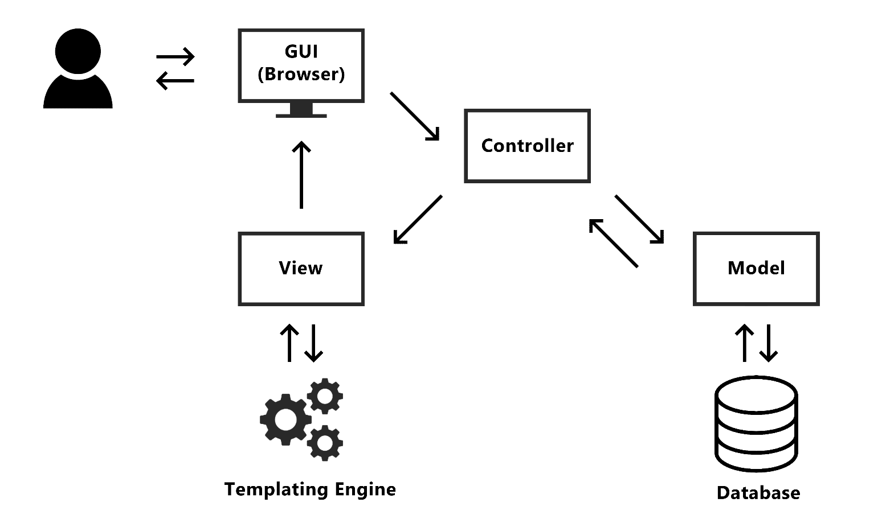

# Model-Controller-View (MCV)

MVC adalah sebuah arsitektur perangkat lunak yang digunakan untuk memisahkan logika aplikasi menjadi tiga komponen utama. Tujuannya adalah agar pengembangan dan pemeliharaan aplikasi menjadi lebih terstruktur dan mudah dilakukan.



1. **Model**\
    _Model_ adalah bagian yang bertanggung jawab untuk mengelola data dan logika bisnis dari aplikasi. Di sinilah semua proses seperti menyimpan, mengambil, mengubah, dan menghapus data dilakukan. Model biasanya berhubungan langsung dengan database.

    Contoh tugas Model:
    - Mengambil data dari database
    - Menyimpan data baru
    - Menjalankan validasi atau aturan bisnis tertentu

2. **View**\
    _View_ adalah bagian yang menangani tampilan antarmuka pengguna. Tujuannya adalah untuk menampilkan data kepada pengguna dan menerima input dari mereka (misalnya form input). View biasanya tidak memiliki logika pemrosesan data—dia hanya "menyajikan".

    Contoh tugas View:
    - Menampilkan daftar produk
    - Menyediakan form untuk input data
    - Menampilkan pesan sukses/gagal

3. **Controller**\
    _Controller_ bertindak sebagai penghubung antara _Model_ dan _View_. Dia menerima input dari pengguna (melalui _View_), memprosesnya (mungkin lewat _Model_), dan menentukan _View_ apa yang akan ditampilkan.

    Contoh tugas Controller:
    - Menerima dan mengolah _request_ dari pengguna
    - Meminta data lewat Model
    - Mengirim data ke _View_ untuk ditampilkan

## Struktur File
Dalam pelajaran ini, kita akan menggunakan formulasi berikut untuk membuat halaman web kita menggunakan model MVC.

Dalam contoh ini kita menggunakan class `Site` sebagai model, `home.jsp` sebagai controller untuk halaman _home_. Untuk _view_ kita menggunakan _sufix_ `.view.jsp` sehingga _view_ untuk `home.jsp` adalah `home.view.jsp`.

file: `Site.class` diletakan di _package_ (contoh _belajarjsp_, sesuaikan dengan project Anda)
```java
package belajarjsp;

// class contoh
// menampilkan Site ID
public class Site {
    public static final String id="Belajar JSP";
    public static String sessionLogin = "";
}
```

Tentu `Site.java` class ini hanya contoh. Nantinya dalam class ini, kita bisa menambahkan berbagai fungsi untuk membaca data dari database (misalnya) atau proses lain. 

file: `home.jsp`
```jsp
<%-- import class (jika diperlukan) --%>
<%@page import="belajarjsp.Site"%>
<%
    // membaca request dan session  
    if(session.getAttribute("login")!=null) {
        Site.sessionLogin = session.getAttribute("login").toString();
    } else {
        Site.sessionLogin = "";
    }
    
    // mengolah data
    //
    //
    
    // set data yang akan ditampilkan ke view
    request.setAttribute("siteId", Site.id);
    request.setAttribute("login", Site.sessionLogin);
    
    // membuka view
    // sesuaikan nama file (.jsp) dengan nama file view yang akan tampilkan
    RequestDispatcher dispacher = request.getRequestDispatcher("home.view.jsp");
    dispacher.forward(request, response);
%>
```

Pada controller (`home.jsp`) kita mengolah data yang akan ditampilkan pada bagian _view_. Desain MVC mendorong user yang bekerja dengan controller tidak perlu berhubungan dengan desain front-end. Dengan demikian, user ini hanya fokus pada _business process_, menggunakan dalam bahasa Java. 

file: `home.view.jsp`
```jsp
<%-- baris berikut diperlukan jika Anda mau menggunakan JSTL --%>
<%@ taglib prefix="c" uri="http://java.sun.com/jsp/jstl/core" %>

<%@page contentType="text/html" pageEncoding="UTF-8"%>
<!DOCTYPE html>
<html>
    <head>
        <meta http-equiv="Content-Type" content="text/html; charset=UTF-8">
        <title>${siteId}</title>
        
        <!-- BOOTSTRAP -->
        <link rel="stylesheet" href="https://cdn.jsdelivr.net/npm/bootstrap@5.3.3/dist/css/bootstrap.min.css" integrity="sha384-QWTKZyjpPEjISv5WaRU9OFeRpok6YctnYmDr5pNlyT2bRjXh0JMhjY6hW+ALEwIH" crossorigin="anonymous">
        <script src="https://cdn.jsdelivr.net/npm/bootstrap@5.3.3/dist/js/bootstrap.min.js" integrity="sha384-0pUGZvbkm6XF6gxjEnlmuGrJXVbNuzT9qBBavbLwCsOGabYfZo0T0to5eqruptLy" crossorigin="anonymous"></script>
    </head>
    <body>
        <!-- CONTENT: hapus/rubah sesuai kebutuhan -->
        <!-- contoh judul -->
        <div class="jumbotron">
            <h1 class="display-4">
                Halo
                <c:if test="${login!=''}">
                    ${sessionLogin}
                </c:if>
                <c:if test="${login==''}">
                    User
                </c:if>
            </h1>
        </div>
        <!-- END: CONTENT -->
    </body>
</html>
```

Pengerjaan bagian _view_ (`home.view.jsp`) hanya berfokus pada bagaimana data ditampilkan, tanpa perlu dipusingkan dengan _bagaimana data dibaca dari database/didapatkan_. Dengan demikian, user yang mengerjakan _view_ ini tidak perlu banyak berhubungan dengan bahasa Java, tapi fokus kepada desain front-end (contoh, menggunakan: CSS, HTML, Javascript) dan menampilkan data menggunakan JSTL dan EL.

`home.view.jsp` juga menyertakan inisialisasi untuk _bootstrap_. Tentu Anda bisa menyertakan library lain seperti _jQuery_, _vanilla JS_, _Tailwind CCSS_, dll, sesuai kebutuhan.
