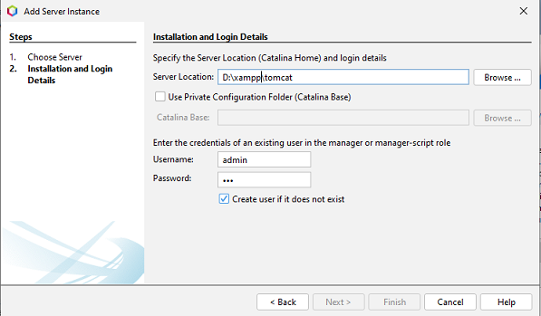
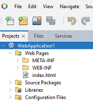
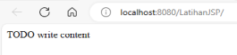

# Setup

## Persiapan
Berikut aplikasi yang akan digunakan dalam perkuliahan.
1. Netbeans (rekomendasi: versi 21)
2. JDK versi 17
3. XAMPP
4. Akun Github + Github Desktop

## Setup Project Pertama

1. Start service _Apache_ dan _Tomcat_ lewat _XAMPP_.
2. Setup koneksi ke server dari Netbeans
   1. Pada Netbeans, klik **Tools - Server**
   2. Klik **Add Server**
   3. Pilih **Apache Tomcat or TomEE**, kemudian **Next**
   4. Set **Server Locations** ke folder Tomcat. Jika Anda menggunakan XAMPP, folder ini berada dalam folder instalasi XAMPP. Contoh, jika folder instalasi ada di `C:\xampp\`, maka folder Tomcat ada di `C:\xampp\tomcat\`\
      Tentukan **Username** dan **Password** yang akan digunakan untuk management server Tomcat, kemudian klik **Finish**\
      
   5. Buat project baru, klik: **File - New Project**
   6. Pilih **Java with Ant - Java Web - Web Application**, kemudian klik **Next**
   7. Tentukan **Project Name** (contoh: `WebApplication1`), kemudian klik **Next**
   8. Pilih **Server**. Jika Anda melakukan langkah 2-4 dengan benar, maka akan ada opsi **Apache Tomcat or TomEE**. Pilih opsi itu kalau klik **Next**
   9. Pada pilihan **Frameworks**, untuk sementara ini Anda bisa abaikan, langsung klik **Finish**
   10. Secara default, file `index.html` sudah dibuatkan. Untuk melihat hasilnya, klik **Run - Run Project** (atau tekan **F6**)
        
   11. Sebuah browser akan terbuka untuk Anda mengarah ke `http://localhost:8080/WebApplication1`.\
       

**Referensi:**
- [Belajar JSP dan Servlet - Cara Membuat Program JSP Hello World](https://www.youtube.com/watch?v=-d2GobvWdro)
- [How to Configure Tomcat Server in Netbeans IDE | Configure Tomcat in Netbeans](https://www.youtube.com/watch?v=KnkKZ2zDfIM)