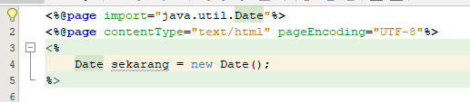

# Java Standard Class

Java menyediakan banyak fungsi yang membantu kita melakukan banyak hal, tapi tidak semua fungsi ini langsung di-_load_ di setiap program yang kita buat. Sebagian fungsi ini harus di-_import_ terlebih dahulu untuk bisa digunakan. Kita akan lihat contoh pada penggunaan class Date yang akan kita gunakan untuk menampilkan tanggal dan waktu _sekarang_.

Perhatikan contoh berikut:\


Pertama kali kita menggunakan Date, maka keyword Date akan ditandai merah. Itu artinya class `Date` belum dikenal. Kita perlu melakukan _import_ package `java.Utils.Date` untuk menggunakan class `Date` ini. Pada Netbeans kita bisa tekan tombol **Alt+Enter** pada keyword `Date`, maka akan muncul pilihan **Add import to java.util.Date**.



Perhatikan, sekarang perintah `<%@page import="java.util.Date"%>` akan ditambahkan pada bagian awal halaman. Perintah tersebut menyiapkan package `java.util.Date` akan bisa diakses oleh halaman ini.

`java.util.Date` merupakan package standard yang berisi berbagai class dan fungsi untuk pengolahan tanggal dan waktu. Dokumentasi dari package ini Anda bisa check di [Dokumentasi Java - Date](https://docs.oracle.com/javase/8/docs/api/java/util/Date.html)

Daftar lengkap dari standard class Anda bisa check di [Dokumentasi Java - API Spesification](https://docs.oracle.com/javase/8/docs/api/overview-summary.html). Dalam dokumentasi ini tentu Anda akan menemukan banyak package yang Anda bisa gunakan. Tentu Anda tidak perlu mempelajari semuanya, Anda hanya perlu mempelajari sesuai kebutuhan.

Jika Anda review kembali pelajaran Java sebelumnya, Anda akan menemukan bahwa dokumentasi yang digunakan adalah sama. Karena memang package yang digunakan pada Java sebelumnya juga adalah package yang sama dengan yang digunakan untuk membuat web dengan Java.

Coba program berikut kemudian lihat hasilnya

```jsp
<%@page import="java.util.Date"%>
<%@page contentType="text/html" pageEncoding="UTF-8"%>
<%
    Date sekarang = new Date();
%>

<!DOCTYPE html>
<html>
    <head>
        <meta http-equiv="Content-Type" content="text/html; charset=UTF-8">
        <title>JSP Page</title>
    </head>
    <body>
        Sekarang <%= sekarang.toString() %><br>
    </body>
</html>
```

## 🙋‍♀️🙋‍♂️ DISKUSI
Untuk keperluan apa kita menggunakan package berikut:
- java.io
- java.sql
- java.util
- java.text
- java.awt
- java.swing
