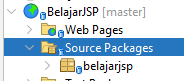
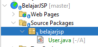

# Membuat _User Defined Class_

Seperti halnya membuat class ketika kita membuat _Java Application_, kita juga bisa membuat class yang bisa kita gunakan untuk halaman JSP kita.

Untuk membuat class, terlebih membuat package terlebih dahulu. Caranya:
1. Klik kanan pada **Source Packages**
2. Pilih **New - Java Packages**
3. Pada **Package Name** tentukan nama package. Disarankan menggunakan _lower case_.\
   Misal pada contoh ini digunakan nama _belajarjsp_ (sesuai dengan contoh nama project)\
   Setelah itu, klik **Finish**\
   

Untuk membuat class
1. Klik kanan pada package yang sebelumnya kita buat (contoh `belajarjsp`).
2. Pilih **New - Java Class**
3. Pada **Class Name** tentukan nama class. Disarankan menggunakan _PascalCase_.\
   Setelah itu, klik **Finish**\
   