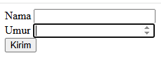
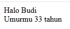
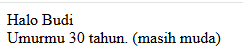
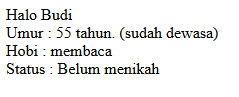

# Latihan 1 - Request Type

Buat form seperti berikut:

file `form3.jsp`

## Soal 1
Buat file `request3.jsp` yang mengolah data yang di POST dari `form3.jsp` dan menampilkan output  seperti berikut:

## Soal 2
Rubah file `request3.jsp` sehingga bisa mengolah data yang di POST dari `form3.jsp` dan menampilkan output seperti berikut:

Jika umur >= 40 tahun, maka keterangan yang ditampilkan adalah _sudah dewasa_\
Jika umur < 40 tahun, maka keterangan yang ditampilkan adalah _masih muda_

## Soal 3
Buat file `form4.jsp` dengan tampilan seperti berikut:

Buat file `request4.jsp` yang mengolah data yang di POST dari `form4.jsp` dan menampilkan output seperti berikut:

