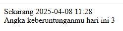
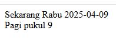

# Latihan 03

## Soal 1

- Buat file `datetime1.jsp` yang isinya menampilkan tanggal dalam format **tahun-bulan-tangga jam:menit**
- Tampilkan juga _nomor keberuntungan_.\
  _Nomor keberuntungan_ adalah bilangan acak antara 1-100.

## Soal 2

Tampilkan tanggal hari ini dalam format seperti berikut:

Jika jam 0-9, maka _keterangan waktu_ adalah "Pagi"\
Jika jam 10-14, maka _keterangan waktu_ adalah "Siang"\
Jika jam 15-17, maka _keterangan waktu_ adalah "Sore"\
Jika jam 18-23, maka _keterangan waktu_ adalah "Malam"
