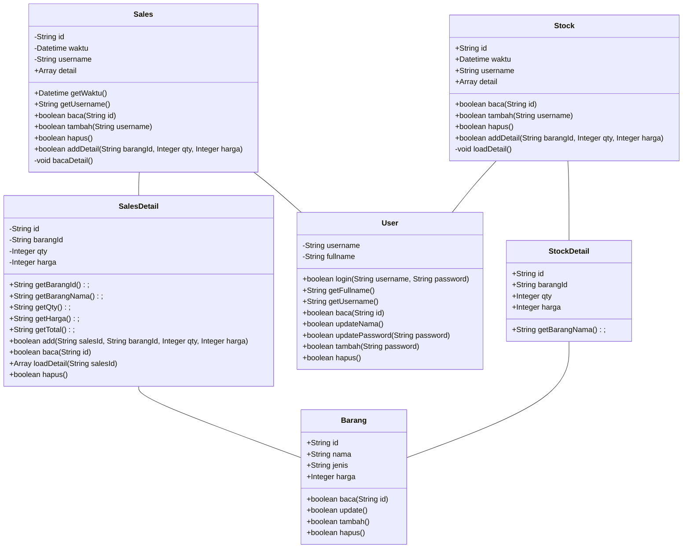

# Project 1 - Toko ATK


Pada project ini, kita akan membuat sebuah web sederhana dengan tema "Toko Buku".

Web ini akan digunakan oleh admin sebuah toko ATK, untuk mencatat transaksi penjualan dan pembelian ATK.

Operator toko ATK ini ada lebih dari satu, masing-masing punya username dan password masing-masing.

> ℹ Untuk project ini kita akan menggunakan folder `tokoatk` pada _Web Pages_ dan _Source Packages_

## Setup Database
Buat database sebagai berikut:


## Class Diagram

Pelajari class diagram berikut



## Contoh Program

file: `Source Packages\tokoatk\User.java`
```java

```