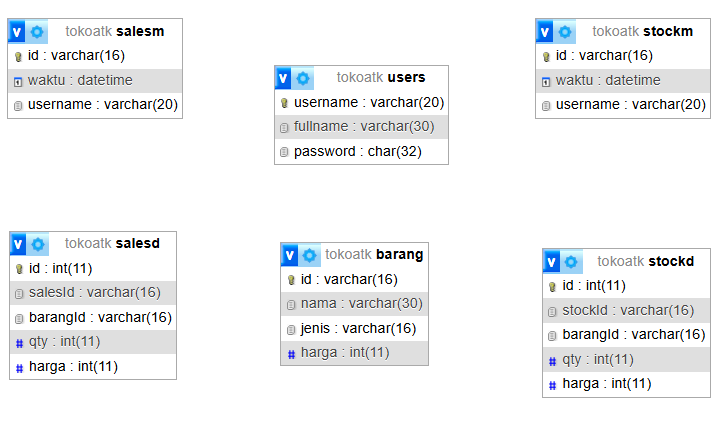
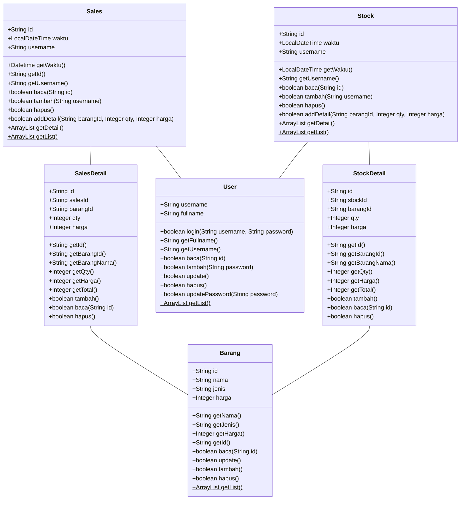

# Project Toko ATK - Fase 1


Pada project ini, kita akan membuat sebuah web sederhana dengan tema "Toko Buku".

Web ini akan digunakan oleh admin sebuah toko ATK, untuk mencatat transaksi penjualan dan pembelian ATK.

Operator toko ATK ini ada lebih dari satu, masing-masing punya username dan password masing-masing.

> ℹ Untuk project ini kita akan menggunakan folder `tokoatk` pada _Web Pages_ dan _Source Packages_

## Setup Database
Buat database `tokoatk` dengan rancangan sebagai berikut:



Pada fase ini, prioritaskan membuat tabel `users`, sisipkan 1 user secara manual:
```sql
INSERT INTO `users` (`username`, `fullname`, `password`) VALUES
('admin', 'Administrator', '202cb962ac59075b964b07152d234b70');
```

## Class Diagram

Pelajari class diagram berikut


> ⚠ Modifier `public` pada masing-masing properti pada class sebenarnya tidak ideal. Tapi untuk kesederhanaan program, sementara untuk class-class ini kita akan menggunakan modifier `public`.


## Siapkan Class

Siapkan file-file berikut:

file: `Source Packages\tokoatk\DbConnection.java`
```java
package tokoatk;

import java.sql.Connection;
import java.sql.DriverManager;

public class DbConnection {
    public static Connection connect() {
        String DBDRIVER = "com.mysql.cj.jdbc.Driver";
        String DBCONNECTION = "jdbc:mysql://localhost:3306/tokoatk";
        String DBUSER = "root";
        String DBPASS = "";

        try {
            Class.forName(DBDRIVER);
            return DriverManager.getConnection(DBCONNECTION, DBUSER, DBPASS);
        } catch(Exception e) {
            throw new IllegalArgumentException("SQL Error");
        }
    }
}
```

file: `Source Packages\tokoatk\User.java`
```java
package tokoatk;

import java.sql.*;
import java.util.ArrayList;

public class User {

    public String username;
    public String fullname;

    public boolean login(String username, String password) {
        Connection conn = null;
        PreparedStatement st;
        ResultSet rs;

        try {
            conn = DbConnection.connect();

            // prepare select statement
            String sql = "SELECT * from users where username=? and md5(?)=password";
            st = conn.prepareStatement(sql);
            st.setString(1, username);
            st.setString(2, password);
            rs = st.executeQuery();

            boolean result = rs.next();
            this.username = username;
            this.fullname = rs.getString("fullname");
            conn.close();

            return true;
        } catch (Exception ex) {
            return false;
        }
    }

    public boolean baca(String username) {
        Connection conn = null;
        PreparedStatement st;
        ResultSet rs;

        try {
            conn = DbConnection.connect();

            // prepare select statement
            String sql = "SELECT * from users where username=?";
            st = conn.prepareStatement(sql);
            st.setString(1, username);
            rs = st.executeQuery();

            boolean result = rs.next();
            this.username = username;
            this.fullname = rs.getString("fullname");
            conn.close();

            return result;
        } catch (Exception ex) {
            return false;
        }
    }

    public String getFullname() {
        return this.fullname;
    }

    public String getUsername() {
        return this.username;
    }

    public boolean update() {
       
        Connection conn = null;
        PreparedStatement st;
        
        try {
            conn = DbConnection.connect();

            // prepare select statement
            String sql = "UPDATE users set fullname=? where username=?";
            st = conn.prepareStatement(sql);
            st.setString(1, fullname);
            st.setString(2, this.username);

            st.executeUpdate();

            conn.close();

            return true;
        } catch (Exception ex) {
            return false;
        }
    }
    
    public boolean updatePassword(String password) {
        Connection conn = null;
        PreparedStatement st;
        
        try {
            conn = DbConnection.connect();

            // prepare select statement
            String sql = "UPDATE users set password=md5(?) where username=?";
            st = conn.prepareStatement(sql);
            st.setString(1, password);
            st.setString(2, username);

            st.executeUpdate();

            conn.close();

            return true;
        } catch (Exception ex) {
            return false;
        }
    }
    
    public boolean hapus() {
        Connection conn = null;
        PreparedStatement st;
        
        try {
            conn = DbConnection.connect();

            // prepare select statement
            String sql = "DELETE FROM users where username=?";
            st = conn.prepareStatement(sql);
            st.setString(1, username);

            st.executeUpdate();

            conn.close();

            return true;
        } catch (Exception ex) {
            return false;
        }
    }

    public boolean tambah(String password) {
        Connection conn = null;
        PreparedStatement st;

        try {
            conn = DbConnection.connect();

            // prepare select statement
            String sql = "INSERT INTO users (username,fullname,password) values (?,?,MD5(?))";
            st = conn.prepareStatement(sql);
            st.setString(1, username);
            st.setString(2, fullname);
            st.setString(3, password);
            st.executeUpdate();
            conn.close();
            
            return true;
        } catch (Exception ex) {
            return false;
        }
    }
    
    public static ArrayList<User> getList() {
        Connection conn = null;
        PreparedStatement st;
        ResultSet rs;
        ArrayList<User> result = new ArrayList<User>();

        try {
            conn = DbConnection.connect();

            // prepare select statement
            String sql = "SELECT * from users";
            st = conn.prepareStatement(sql);
            rs = st.executeQuery();

            while(rs.next()) {
                User entry = new User();
                entry.baca(rs.getString("username"));
                result.add(entry);
            }
            conn.close();

            return result;
        } catch (Exception ex) {
            return null;
        }
    }
}
```

file: `Web Pages/tokoatk/index.jsp`
```jsp
<%
    if(session.getAttribute("fullname")==null) {
        response.sendRedirect("formlogin.jsp");
    } else {
        response.sendRedirect("home.jsp");
    }
%>
```

file: `Web Pages/tokoatk/formlogin.jsp`
```jsp
<%
    RequestDispatcher dispacher = request.getRequestDispatcher("formlogin.view.jsp");
    dispacher.forward(request, response);
%>
```

file: `Web Pages/tokoatk/formlogin.view.jsp`
```jsp
<%@page contentType="text/html" pageEncoding="UTF-8"%>
<!DOCTYPE html>
<html>
    <head>
        <meta http-equiv="Content-Type" content="text/html; charset=UTF-8">
        <title>Login</title>
    </head>
    <body>
        <form action="login.jsp" method="post">
            <input name="username"><br>
            <input name="password" type="password">
            <button type="submit">Login</button>
        </form>
    </body>
</html>
```

file: `Web Pages/tokoatk/login.jsp`
```jsp
<%@page import="tokoatk.User"%>
<%
    String username = request.getParameter("username");
    String password = request.getParameter("password");
    
    User user = new User();
    if(user.login(username, password)) {
        session.setAttribute("fullname", user.getFullname());
        response.sendRedirect("home.jsp");
    } else {
            response.sendRedirect("formlogin.jsp");
    }

%>
```

file: `home.jsp`
```jsp
<%
    String fullname = session.getAttribute("fullname").toString();
    
    request.setAttribute("fullname", fullname);
    
    RequestDispatcher dispacher = request.getRequestDispatcher("home.view.jsp");
    dispacher.forward(request, response);
%>
```

file: `home.view.jsp`
```jsp
<%@page contentType="text/html" pageEncoding="UTF-8"%>
<!DOCTYPE html>
<html>
    <head>
        <meta http-equiv="Content-Type" content="text/html; charset=UTF-8">
        <title>JSP Page</title>
    </head>
    <body>
        <h1>Hello ${fullname}</h1>
        <a href="userlist.jsp">List User</a>
    </body>
</html>
```

file: `Web Pages/tokoatk/userlist.jsp`
```jsp
<%@page import="tokoatk.User"%>
<%@page import="java.util.ArrayList"%>
<%
    ArrayList<User> list = User.getList();
    
    request.setAttribute("list", list);
    
    RequestDispatcher dispacher = request.getRequestDispatcher("userlist.view.jsp");
    dispacher.forward(request, response);
%>
```

file: `Web Pages/tokoatk/userlist.view.jsp`
```jsp
<%@ taglib prefix="c" uri="http://java.sun.com/jsp/jstl/core" %>
<%@page contentType="text/html" pageEncoding="UTF-8"%>
<!DOCTYPE html>
<html>
    <head>
        <meta http-equiv="Content-Type" content="text/html; charset=UTF-8">
        <title>User List</title>
    </head>
    <body>
        <h1>User List</h1>
        <a href="formusertambah.jsp">user baru</a>
        <hr>
    <c:forEach var="user" items="${list}">
        ${user.getFullname()}
    </c:forEach>
    </body>
</html>
```

file: `Web Pages/tokoatk/usertambah.jsp`
```jsp
<%@page import="tokoatk.User"%>
<%
    String username = request.getParameter("username").toString();
    String fullname = request.getParameter("fullname").toString();
    String password = request.getParameter("password").toString();
    
    User user = new User();
    user.username = username;
    user.fullname = fullname;
    user.tambah(password);
    
    response.sendRedirect("userlist.jsp");
%>
```

file: `Web Pages/tokoatk/formusertambah.jsp`
```jsp
<%
    RequestDispatcher dispacher = request.getRequestDispatcher("formusertambah.view.jsp");
    dispacher.forward(request, response);
%>
```

file: `Web Pages/tokoatk/formusertambah.view.jsp`
```jsp
<%@page contentType="text/html" pageEncoding="UTF-8"%>
<!DOCTYPE html>
<html>
    <head>
        <meta http-equiv="Content-Type" content="text/html; charset=UTF-8">
        <title>Add User</title>
    </head>
    <body>
        <h1>Add User</h1>
        <form action="usertambah.jsp" method="post">
            Username: <input name="username"><br>
            Fullname: <input name="fullname"><br>
            Password: <input name="password"><br>
            <button type="submit">Tambah</button>
        </form>
    </body>
</html>
```

## Soal Latihan:
- Buat tabel `barang`
- Buat class `Barang`
- Buat `baranglist.jsp`, `baranglist.view.jsp`, `barangtambah.jsp`, `formtambahbarang.jsp`, `formbarangtambah.view.jsp`