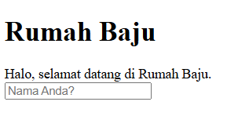
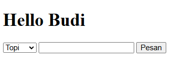
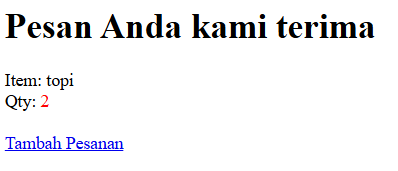

# Soal 10

Dengan menggunakan design MVC, buat website seperti berikut:

`home.jsp` & `home.view.jsp`\
form meminta input nama, kemudian mengirimkannya ke `form.jsp`\

`form.jsp` & `form.view.jsp`\
Memproses data yang di-POST (dari `home`), menyimpannya dalam session, kemudian menampilkan form untuk pemesanan. Kirim data dari form ke `order.jsp`.\
    

`order.jsp` & `order.view.jsp`\
Memproses data yang di-POST dan menampilkannya. Tambahkan link _Tambah Pesanan_ yang mengarah ke `form.jsp`.\
