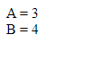

# Soal 1

File **soal1.jsp**
```java
<%@page contentType="text/html" pageEncoding="UTF-8"%>
<!DOCTYPE html>
<html>
    <head>
        <meta http-equiv="Content-Type" content="text/html; charset=UTF-8">
    </head>
    <body>
        <form action="proses.jsp" method="post">
            A <input name="a"><br>
            B <input name="b"><br>
            <button type="submit">Kirim</button>
        </form>
    </body>
</html>
```

File **proses.jsp**
```java
<%@page contentType="text/html" pageEncoding="UTF-8"%>
<%
    String a = _________(a)_________ ;
    String b = _________(b)__________;    
%>
<!DOCTYPE html>
<html>
    <head>
        <meta http-equiv="Content-Type" content="text/html; charset=UTF-8">
    </head>
    <body>
        A = ______(c)______<br>  <!-- menampilkan A -->
        B = ______(d)______<br>  <!-- menampilkan B -->
    </body>
</html>

```

**contoh output file proses.jsp :**



---

### Soal:
File **soal1.jsp** jika dibuka akan menampilkan form dengan 2 input, masing-masing `a` dan `b`.

Ketika di _submit_, inputan akan dikirimkan ke **proses.jsp** untuk kemudian ditampilkan.

Tuliskan kode program pada bagian yang ditandasi **(a)**, **(b)**, **(c) **dan **(d)**
