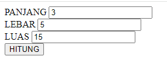

# Soal 3

Berikut adalah file JSP sederhana menghitung luas persegi dengan input `panjang` dan `lebar`.

File **soal3.jsp**
```java
<%-- file: soal3.jsp -->
<%@page contentType="text/html" pageEncoding="UTF-8"%>
<%
    int panjang = 0;
    int lebar = 0;
    int luas = 0;
    if(request.getParameter("panjang")!=null) {
        panjang = _______(a)___________(request.getParameter("panjang"));
        lebar = Integer.parseInt(_________(b)__________);
        luas = _______(c)_______ ;  // rumus luas persegi
    } 
%>
<!DOCTYPE html>
<html>
    <head>
        <meta http-equiv="Content-Type" content="text/html; charset=UTF-8">
        <title>Soal 3</title>
    </head>
    <body>
        <form action="_______(d)_________" method="post">
            PANJANG <input name="panjang" value="_______(e)_______"><br>
            LEBAR <input name="lebar" value="_______(f)_________"><br>
            LUAS _______(g)_________ <br>
            <button type="submit">Kirim</button>
        </form>
    </body>
</html>

```

**Contoh Output:**



---

### Soal

Tuliskan kode program pada bagian yang ditandai **(a)**, **(b)**, **(c)**, ...
