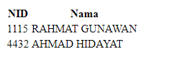

# Soal 4

Berikut contoh menampilkan daftar dosen menggunakan menthod `getList()` pada class `Dosen`.

file **daftar_dosen.jsp**

```java
<%@page import="java.util.List"%>
<%@page contentType="text/html" pageEncoding="UTF-8"%>
<%@page import="kampus.Dosen" %>
<%
    List<Dosen> data = Dosen.getList();
%>
<!DOCTYPE html>
<html>
    <head>
        <meta http-equiv="Content-Type" content="text/html; charset=UTF-8">
        <title>Data Dosen</title>
    </head>
    <body>
        <table>
            <thead>
                <tr>
                    <th>NID</th>
                    <th>Nama</th>
                    <th></th>
                </tr>
            </thead>
            <tbody>
                <% for(____(a)____ baris : ____(b)_____) { %>
                <tr>
                    <td>____(c)____</td>
                    <td>____(d)____</td>
                </tr>
                <% }%>
            </tbody>
        </table>
    </body>
</html>
```

**contoh output:**



---

Tuliskan kode program pada bagian yang ditandai **(a)**, **(b)**, **(c)**, **(d)**