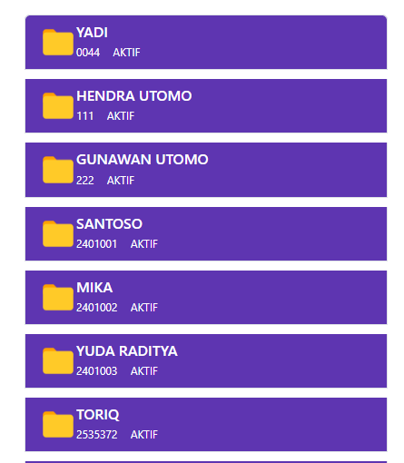

# Soal 6

Coba buat file `data_mahasiswa2.jsp` dari kode program berikut:
```java
<%@page import="java.util.List"%>
<%@page contentType="text/html" pageEncoding="UTF-8"%>
<%@page import="kampus.Mahasiswa">
<%
    List<Mahasiswa> daftar = Mahasiswa.getList();
%>
<!DOCTYPE html>
<html>    
    <head>
        <meta http-equiv="Content-Type" content="text/html; charset=UTF-8">
        <title>Data Mahasiswa</title>
        <link href="https://cdn.jsdelivr.net/npm/bootstrap@5.3.3/dist/css/bootstrap.min.css" rel="stylesheet" integrity="sha384-QWTKZyjpPEjISv5WaRU9OFeRpok6YctnYmDr5pNlyT2bRjXh0JMhjY6hW+ALEwIH" crossorigin="anonymous">
        <script src="https://stackpath.bootstrapcdn.com/bootstrap/4.4.1/js/bootstrap.bundle.min.js" integrity="sha384-YvpcrYf0tY3lHB60NNkmXc5s9fDVZLESaAA55NDzOxhy9GkcIdslK1eN7N6jIeHz" crossorigin="anonymous"></script>
        <script src="https://cdnjs.cloudflare.com/ajax/libs/jquery/3.2.1/jquery.min.js" ></script>

        <style>
            .list-group{
                width: 400px !important;
            }

            .list-group-item{
                margin-top:10px;
                border-radius: none;
                background: #5E35B1;
                cursor: pointer;
                transition: all 0.3s ease-in-out;
                color: white;
            }

            .list-group-item:hover{
                transform: scaleX(1.1);
            }

            .check{
                opacity: 0;
                transition: all 0.6s ease-in-out;
            }

            .list-group-item:hover .check {
                opacity: 1;
            }

            .about span{
                font-size: 12px;
                margin-right: 10px;
            }

            input[type=checkbox] {
                position: relative;
                cursor: pointer;
            }
            input[type=checkbox]:before {
                content: "";
                display: block;
                position: absolute;
                width: 20px;
                height: 20px;
                top: 0px;
                left: 0;
                border: 1px solid #10a3f9;
                border-radius: 3px;
                background-color: white;
            }
            input[type=checkbox]:checked:after {
                content: "";
                display: block;
                width: 7px;
                height: 12px;
                border: solid #007bff;
                border-width: 0 2px 2px 0;
                -webkit-transform: rotate(45deg);
                -ms-transform: rotate(45deg);
                transform: rotate(45deg);
                position: absolute;
                top: 2px;
                left: 6px;
            }

            input[type="checkbox"]:checked + .checks {
                opacity: 1;
            }
        </style>
    </head>
    <body>
        <div class="container d-flex justify-content-center">

            <ul class="list-group mt-5 text-white">
                <li class="list-group-item d-flex justify-content-between align-content-center">

                    <div class="d-flex flex-row">
                        
                        <div class="ml-2">
                            <h6 class="mb-0">Ogivet Maither</h6>
                            <div class="about">
                                <span>22 Files</span>
                                <span>Jan 21, 2020</span>
                            </div>
                        </div>
                    </div>

                </li>

                <li class="list-group-item d-flex justify-content-between align-content-center">

                    <div class="d-flex flex-row">
                        
                        <div class="ml-2">
                            <h6 class="mb-0">Macan Worldgroup</h6>
                            <div class="about">
                                <span>62 Files</span>
                                <span>Jan 22, 2020</span>
                            </div>
                        </div>
                    </div>

                </li>
                <li class="list-group-item d-flex justify-content-between align-content-center">

                    <div class="d-flex flex-row">
                        
                        <div class="ml-2">
                            <h6 class="mb-0">Organ parts</h6>
                            <div class="about">
                                <span>82 Files</span>
                                <span>Jan 29, 2020</span>
                            </div>
                        </div>
                    </div>
                </li>

                <li class="list-group-item d-flex justify-content-between align-content-center">
                    <div class="d-flex flex-row">
                        
                        <div class="ml-2">
                            <h6 class="mb-0">Engine parts</h6>
                            <div class="about">
                                <span>182 Files</span>
                                <span>Jan 29, 2020</span>
                            </div>
                        </div>
                    </div>

                </li>
                <li class="list-group-item d-flex justify-content-between align-content-center">
                    <div class="d-flex flex-row">
                        
                        <div class="ml-2">
                            <h6 class="mb-0">Turbine parts</h6>
                            <div class="about">
                                <span>802 Files</span>
                                <span>Jan 29, 2020</span>
                            </div>
                        </div>
                    </div>
                </li>
            </ul>
        </div>
    </body>
</html>
```

## Soal:

Berdasarkan contoh program diatas, buat file `data_mahasiswa2.jsp` untuk menampilkan data mahasiswa menjadi seperti berikut:


