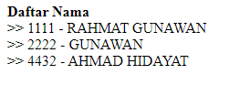

# Soal 8

Berikut contoh menampilkan daftar dosen menggunakan menthod `getList()` pada class `Dosen`.

file **daftar_dosen.jsp**

```java
<%@page import="java.util.List"%>
<%@page contentType="text/html" pageEncoding="UTF-8"%>
<%@page import="kampus.Dosen" %>
<%
    List<Dosen> data = Dosen.getList();
%>
<!DOCTYPE html>
<html>
    <head>
        <meta http-equiv="Content-Type" content="text/html; charset=UTF-8">
        <title>Data Dosen</title>
    </head>
    <body>
        __________(a)_________
        <% for(____(b)____ baris : ____(c)_____) { %>
            _________(d)_______
        <% } %>
            
    </body>
</html>
```

Program diatas menampilkan output daftar _NID_ dan _Nama_ dosen seperti berikut.



---

Tuliskan kode program pada bagian yang ditandai **(a)**, **(b)**, **(c)**, **(d)**

**Catatan:** daftar dibuat tanpa menggunakan tag `<ul>`, `<li>`