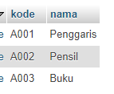

# Soal 9

Pada database MySql, kita memiliki tabel `barang` yang terdiri dari 2 kolom _VARCHAR_ seperti berikut:



Untuk mengakses data pada tabel tersebut, kita menggunaka objek `PreparedStatement` seperti berikut:

```java
String kode = request.getParameter("kode");
String nama = request.getParameter("nama");

String sql = "INSERT INTO _____[A]_____ (kode, nama) _____[B]_____ (?, ?)";
PreparedStatement st = connection.prepareStatement(sql);
st._____[C]_____(1, ______[D]______);
st._____[E]_____(2, ______[F]______);


```

❓ Lengkapi program diatas dengan mengisi bagian yang ditandai `_____[ ]_____`
